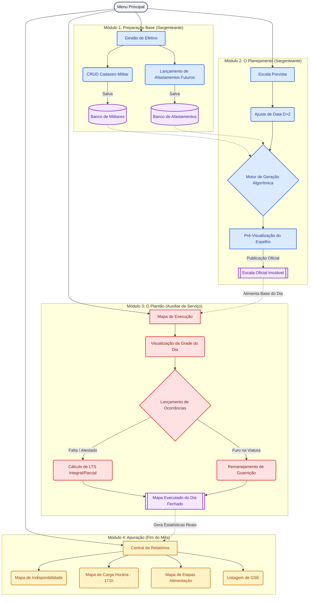

# Organograma do Sistema de Escalas

Este diagrama mapeia o fluxo completo de dados e as responsabilidades dos usuários dentro do sistema. Ele mostra o caminho desde o cadastro base até a ponta final (os relatórios financeiros que ainda serão construídos).

## Como ler este diagrama:
1. Os balões em **Azul** representam o trabalho prévio do Sargenteante (planejar o futuro e criar a escala imutável).
2. Os balões em **Vermelho** representam a correria do Auxiliar de Serviço (registrar o que de fato aconteceu no dia).
3. Os balões em **Roxo** são os depósitos de dados (o banco que vai ganhando robustez).
4. Os balões em **Amarelo/Laranja** são os frutos do trabalho: os relatórios consolidados que fecham o mês blindando o batalhão contra erros financeiros.
